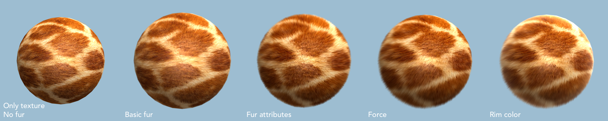
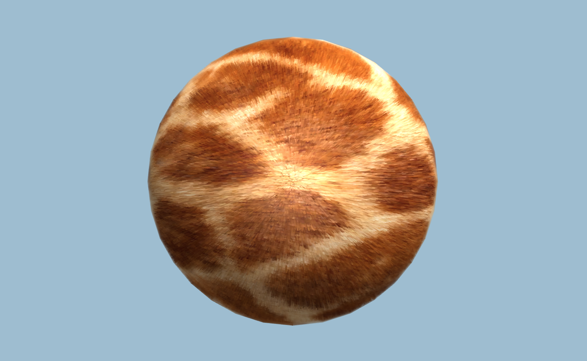
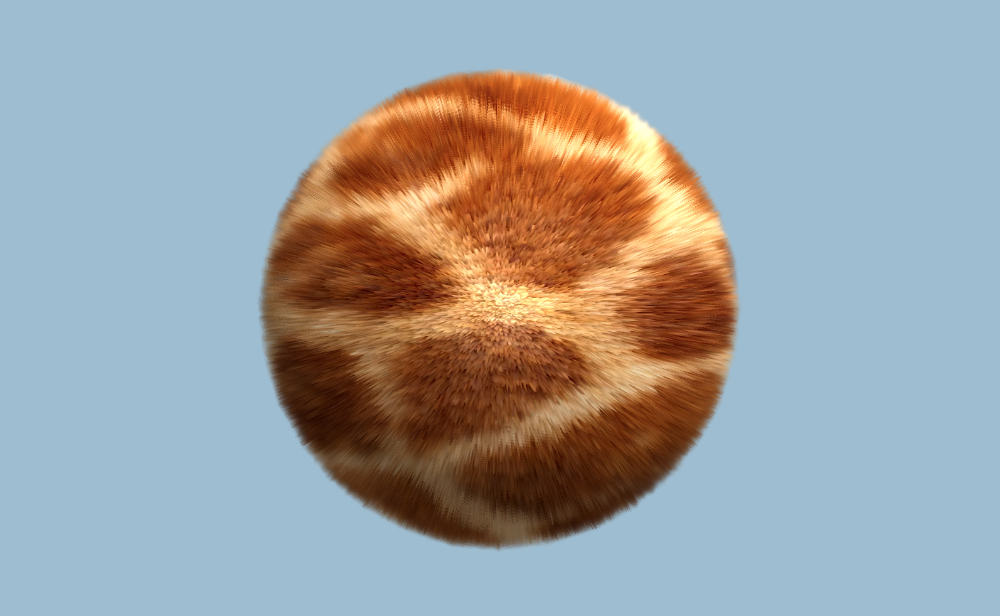
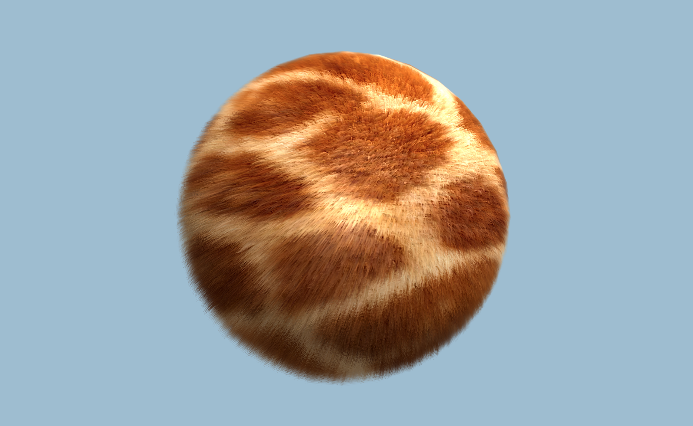
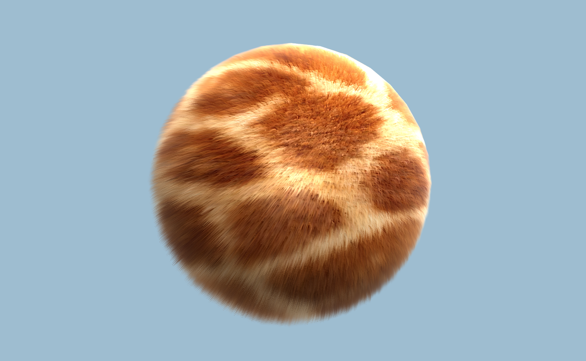

# Unity Fur Shader
🐈Fur shader for Unity.

#### 0.1 Basic
Basic fur shader with ambient, diffuse and specular.

#### 0.2 Attributes
Add fur attributes: density, thinness, shading.

#### 0.3 Force
Add force: global force and localforce .

#### 0.4 Rim Color
Add rim color

### Thanks

[Fur Effects - Teddies, Cats, Hair ....](http://www.xbdev.net/directx3dx/specialX/Fur/index.php)

[Fur shader - Shaders Laboratory](http://www.shaderslab.com/demo-60---fur-shader.html)
